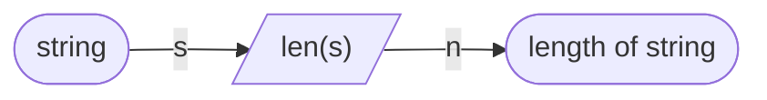

# 1. Взятие по индексу и len
## Теория
> len - функция, возвращающая длину строки.
```python
s = "I love python"
n = len(s)  # n == 13
```


> Взятие по индексу:
```python
#   [0123456] - индексы
s = "Python!"
char = s[0]  # char == "P"
char = s[3]  # char == "h"
char = s[6]  # char == "!"
char = s[7]  # ERROR! (index out of range)
```

## Задачи
### 1. Первый и последний символ строки:
```cpp
Введите строку: Программирование
Первый символ: П
Последний символ: е
```

### 2. Печать через символ:
Напишите программу, которая запрашивает у пользователя строку и выводит каждый второй символ этой строки на новой строке.
```cpp
Введите строку: Привет!
П
и
е
!
```

### 3. Печать первой половины строки:
Всё то же самое, только необходимо вывести первую половину строки в столбик. Если длина нечётная, вывести не включая центральный символ:
```cpp
Введите строку: Привет!
П
р
и
```

### 4. Палиндром**:
Пользователь вводит строку, необходимо определить, является ли она палиндромом.
> строка является палиндромом, если читается в обе стороны одинаково:
```cpp
Введите строку: шалаш
Палиндром

Введите строку: qwertytrewq
Палиндром

Введите строку: ABCDEFG
Не палиндром
```

> Сравнивать строки можно так же, как и числа:
```python
'a' == 'a'      # True
'abc' == 'abc'  # True
'c' != 'v'      # True

s = "door"
s == 's'      # False (s - переменная c значением "door")
s[1] == s[2]  # True
```

